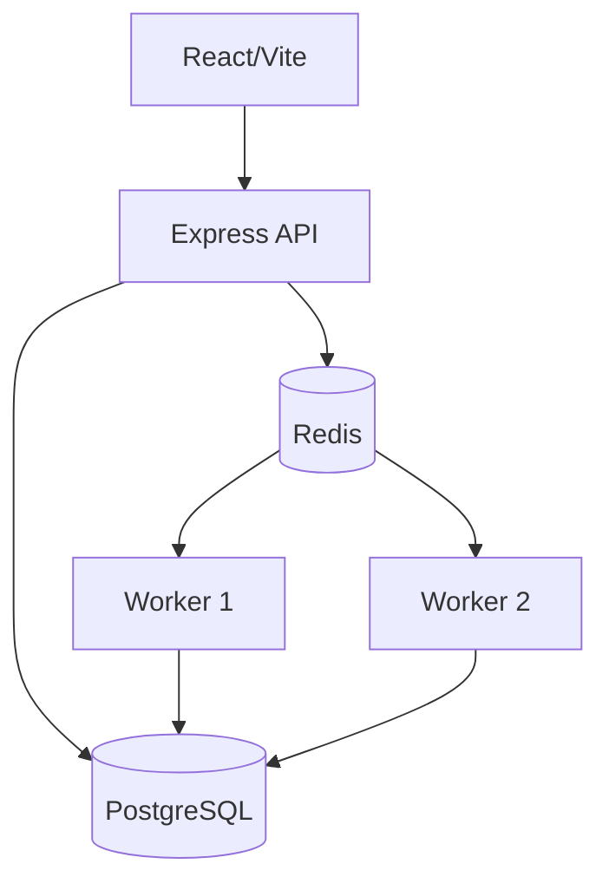

# Architecture

The API owns authentication and durable state changes. PostgreSQL is the source of truth for organizations, queues, jobs, executions, logs, workers, and DLQ entries. Redis is reserved for low-latency dispatch and coordination. Independent workers claim work using PostgreSQL row locks (`FOR UPDATE SKIP LOCKED`) so multiple worker processes cannot execute the same job.

