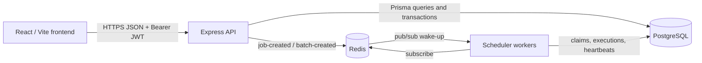

# Architecture

## Responsibilities

**Frontend.** Renders the dashboard and sends authenticated API requests. It does not decide authorization, claim jobs, or retain backend secrets.

**API.** Validates inputs with Zod, verifies JWTs, enforces organization membership, changes durable records through Prisma, and publishes notifications after job/batch creation.

**PostgreSQL.** Holds durable tenant, job, execution, retry, DLQ, worker, and heartbeat state. It is the concurrency boundary: workers use transactions and row locks for exclusive claims.

**Redis.** Supplies best-effort low-latency new-job and batch notifications. It is not a durable queue; polling PostgreSQL is the fallback.

**Workers.** Subscribe and poll, atomically claim work, enforce queue concurrency, execute supported handlers, heartbeat active jobs, recover stale work, and perform lease-fenced complete/retry/DLQ updates.

## Reliability path

1. The API validates an authorized request and commits it to PostgreSQL.
2. It publishes a Redis wake-up notification after the durable write.
3. A worker claims the eligible job with `FOR UPDATE SKIP LOCKED`.
4. The worker records an execution and refreshes worker/job leases while running.
5. It completes, retries, or DLQs the job only if it still owns the active lease.

Correctness is therefore database-backed; Redis reduces latency only.
