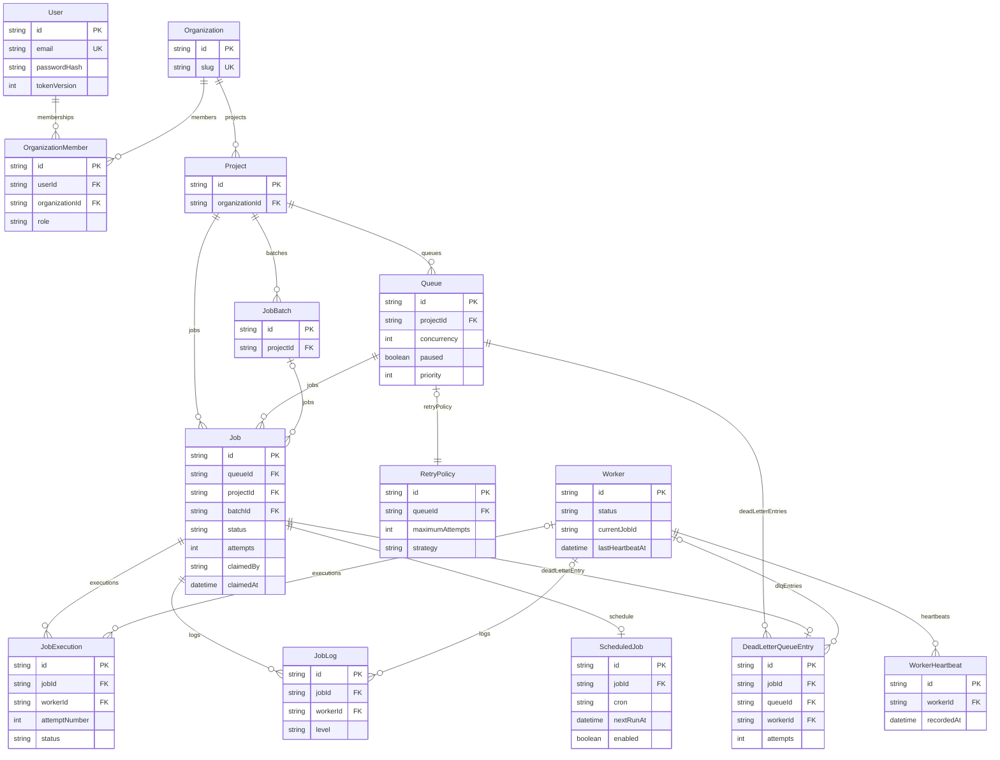

# Entity relationship diagram

This Mermaid diagram reflects relations in `backend/prisma/schema.prisma`.

```mermaid
erDiagram
    User ||--o{ OrganizationMember : memberships
    Organization ||--o{ OrganizationMember : members
    Organization ||--o{ Project : projects
    Project ||--o{ Queue : queues
    Project ||--o{ Job : jobs
    Project ||--o{ JobBatch : batches
    Queue o|--|| RetryPolicy : retryPolicy
    Queue ||--o{ Job : jobs
    Queue ||--o{ DeadLetterQueueEntry : deadLetterEntries
    JobBatch o|--o{ Job : jobs
    Job ||--o{ JobExecution : executions
    Job ||--o{ JobLog : logs
    Job ||--o| ScheduledJob : schedule
    Job ||--o| DeadLetterQueueEntry : deadLetterEntry
    Worker o|--o{ JobExecution : executions
    Worker o|--o{ JobLog : logs
    Worker o|--o{ DeadLetterQueueEntry : dlqEntries
    Worker ||--o{ WorkerHeartbeat : heartbeats

    User {
        string id PK
        string email UK
        string passwordHash
        int tokenVersion
    }
    Organization {
        string id PK
        string slug UK
    }
    OrganizationMember {
        string id PK
        string userId FK
        string organizationId FK
        string role
    }
    Project {
        string id PK
        string organizationId FK
    }
    Queue {
        string id PK
        string projectId FK
        int concurrency
        boolean paused
        int priority
    }
    RetryPolicy {
        string id PK
        string queueId FK
        int maximumAttempts
        string strategy
    }
    JobBatch {
        string id PK
        string projectId FK
    }
    Job {
        string id PK
        string queueId FK
        string projectId FK
        string batchId FK
        string status
        int attempts
        string claimedBy
        datetime claimedAt
    }
    JobExecution {
        string id PK
        string jobId FK
        string workerId FK
        int attemptNumber
        string status
    }
    JobLog {
        string id PK
        string jobId FK
        string workerId FK
        string level
    }
    Worker {
        string id PK
        string status
        string currentJobId
        datetime lastHeartbeatAt
    }
    WorkerHeartbeat {
        string id PK
        string workerId FK
        datetime recordedAt
    }
    ScheduledJob {
        string id PK
        string jobId FK
        string cron
        datetime nextRunAt
        boolean enabled
    }
    DeadLetterQueueEntry {
        string id PK
        string jobId FK
        string queueId FK
        string workerId FK
        int attempts
    }
```
