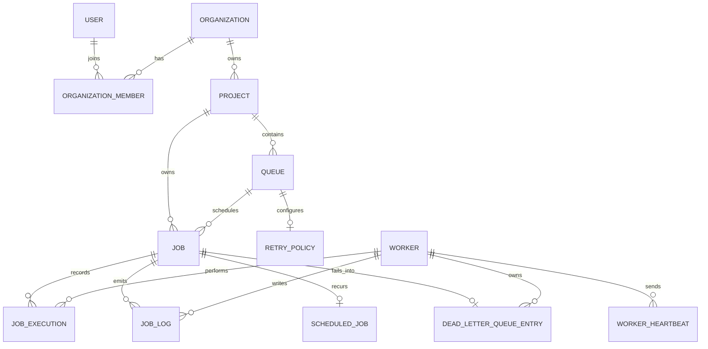

# Entity Relationship Diagram

```mermaid
erDiagram
  USER ||--o{ ORGANIZATION_MEMBER : joins
  ORGANIZATION ||--o{ ORGANIZATION_MEMBER : has
  ORGANIZATION ||--o{ PROJECT : owns
  PROJECT ||--o{ QUEUE : contains
  PROJECT ||--o{ JOB : owns
  QUEUE ||--o{ JOB : schedules
  QUEUE ||--o| RETRY_POLICY : configures
  JOB ||--o{ JOB_EXECUTION : records
  JOB ||--o{ JOB_LOG : emits
  JOB ||--o| SCHEDULED_JOB : recurs
  JOB ||--o| DEAD_LETTER_QUEUE_ENTRY : fails_into
  WORKER ||--o{ WORKER_HEARTBEAT : sends
  WORKER ||--o{ JOB_EXECUTION : performs
  WORKER ||--o{ JOB_LOG : writes
  WORKER ||--o{ DEAD_LETTER_QUEUE_ENTRY : owns
```
